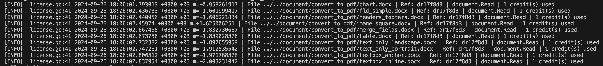

### Metered License Key Usage Logs
When Using unioffice it is possible to see the usage logs of license key in every run. To enable this behavior all we have to do is setting the `UsageLog` to verbose and the log level to `Info` or above as follows.

```go
// Set the log level to info or higher
	logger.SetLogger(logger.NewConsoleLogger(logger.LogLevelInfo))

// Enable the verbose mode logging
license.SetMeteredKeyUsageLogVerboseMode(true)
```
Sample output 

#### Examples 
- [Usage Logs for Docs to PDF Conversion](main.go) This example shows how to display license usage logs for docs to pdf conversion process.


